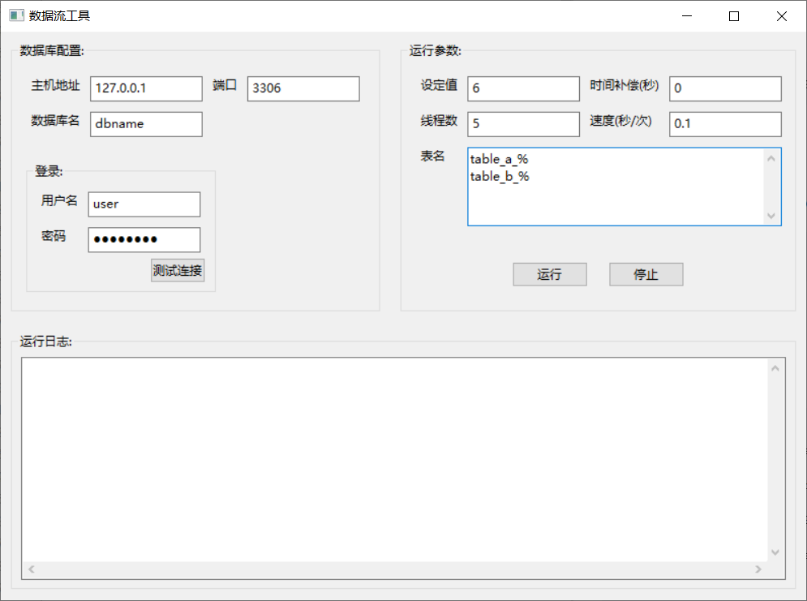

Fake Stream
===========
> A fake data stream for automatically inserting given strings to database.

Install
-------
Just run `build.sh` script that OK (**Only Windows system was checked**).

```
> sh build.sh
```

Usage
-----
Double click this program and fill in the blank like the follow image.



Release logs
------------

#### V2.0.0 at 2022/08/28

* Support GUI page and multithreading.
* Support for saving last running status.

#### V2.1.0 at 2023/03/12

* Support for selecting database.
* Support user-defined data generation through regular expression and python Faker package.

#### Done

- [x] Support choosing the one from last some running status. :heavy_check_mark:
- [x] Support random values. :heavy_check_mark:
- [x] Perfect compatibility with all data types and the higher MySQL version. :heavy_check_mark:
